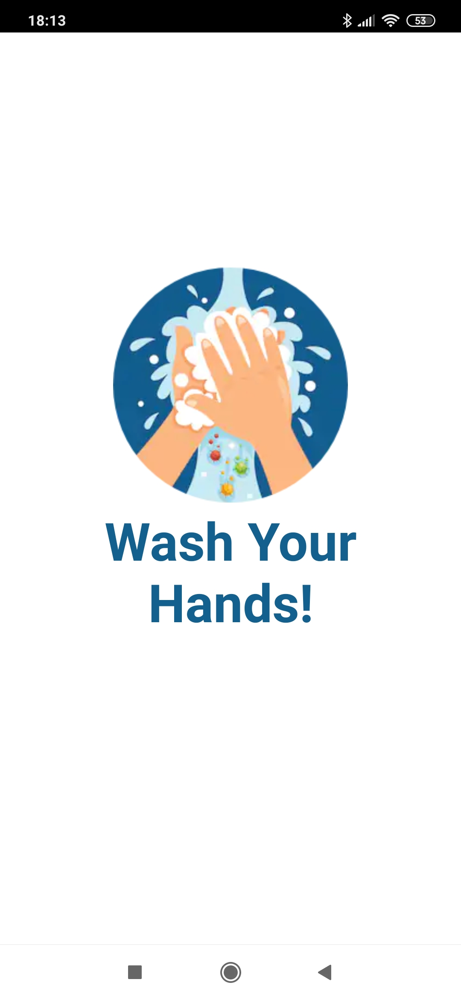
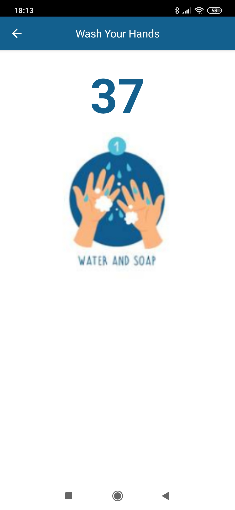
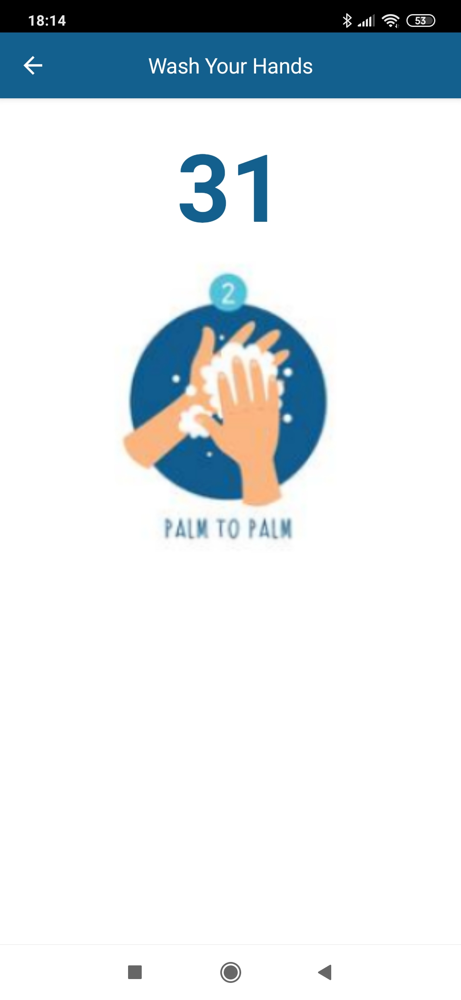
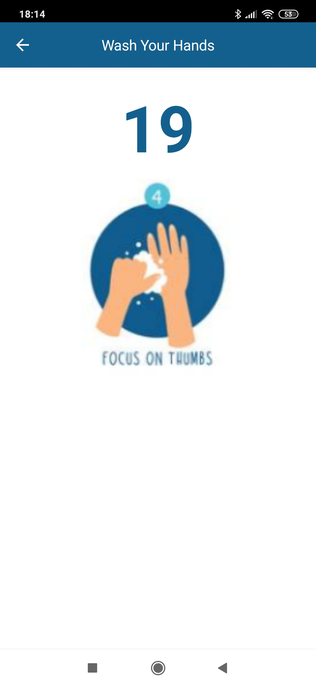
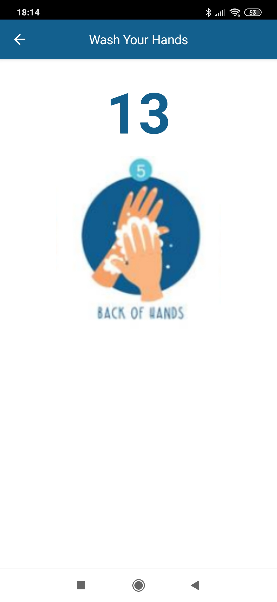
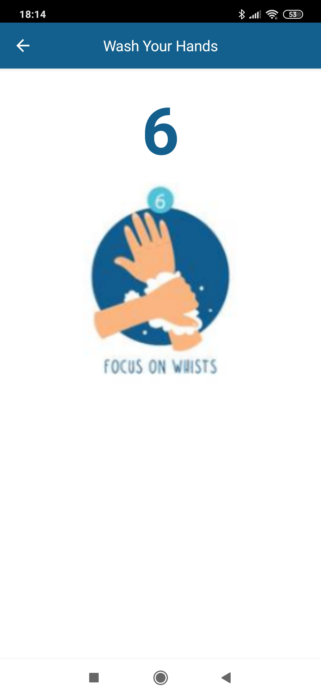

# mat|r Wash Your Hands App
Data and code of Wash Your Hands App, a mobile application that I developed with [mat|r script](https://www.matrproject.com/).

This app shows the steps to follow for proper and thorough hand washing to prevent the spread of COVID-19.

**Programming Language:** mat|r script

