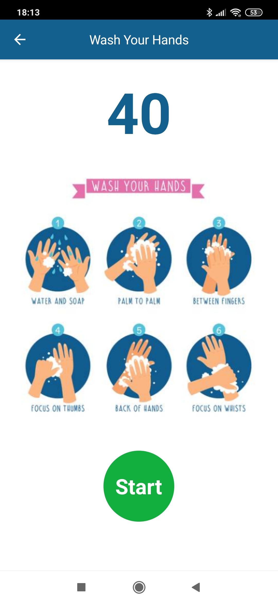
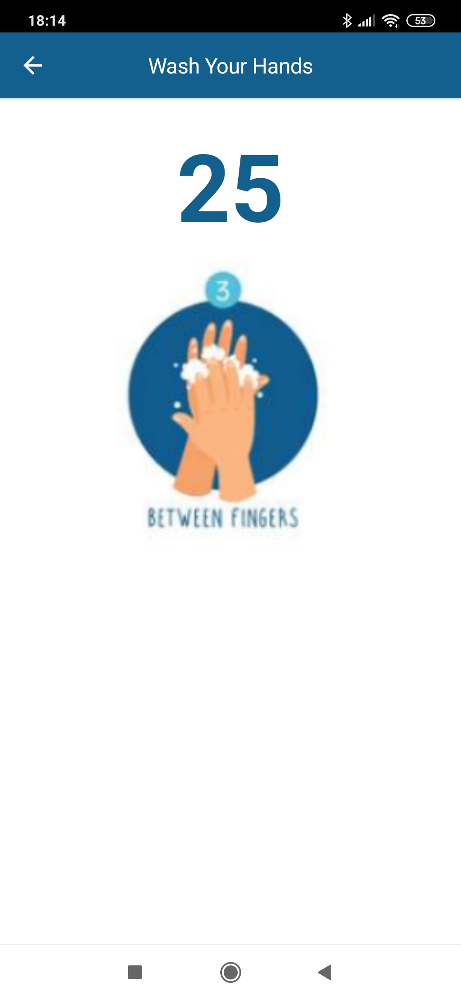

# mat|r Wash Your Hands App
Data and code of Wash Your Hands App, a mobile application that I developed with [mat|r script](https://www.matrproject.com/)  for Android and iOS devices.

This app shows the steps to follow for proper and thorough hand washing to prevent the spread of COVID-19.

**Programming Language:** mat|r script

**Test App:** download the [mat|r Viewer](http://matrproject.com/docs/eng/viewer-eng/), a tool which allows you visualizing and testing the developed app instantly in compatible platforms. Visualize the app on your phone scanning the QR code with mat|r Viewer: https://platform.matrproject.com/hub/view/5e74dc001c30f500134be590

**Author:** Agustina Dinamarca (agustinadinamarca@gmail.com)

